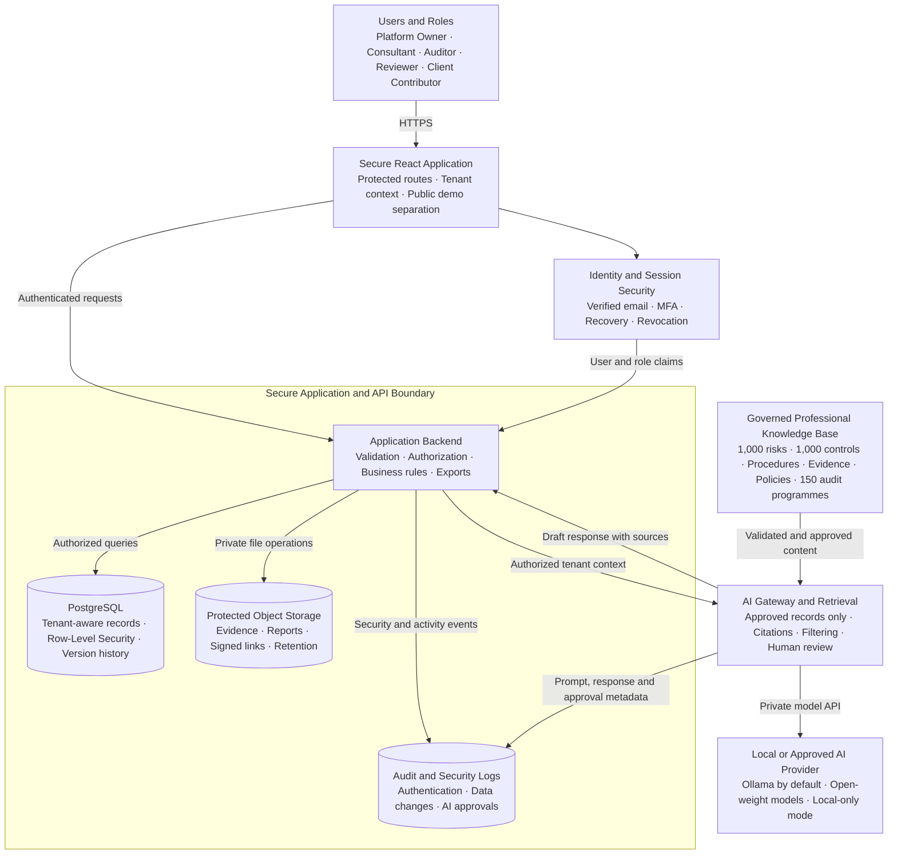

# Audit Intelligence Hub Secure Architecture Diagram



## Security boundaries

- The browser never receives database administrative credentials or AI provider secrets.
- Authentication is combined with authorization on every backend request.
- Every professional record carries organization, client and engagement context.
- Database row-level policies prevent cross-tenant access.
- Evidence files use private storage, signed links, retention controls and validation.
- AI retrieval is limited to approved records the authenticated user may access.
- AI outputs remain drafts until a professional approves them.
- Public GitHub Pages demo data is separated from the secure professional workspace.

## Recommended repository paths

```text
docs/diagrams/secure-architecture.md
docs/diagrams/secure-architecture.png
```
